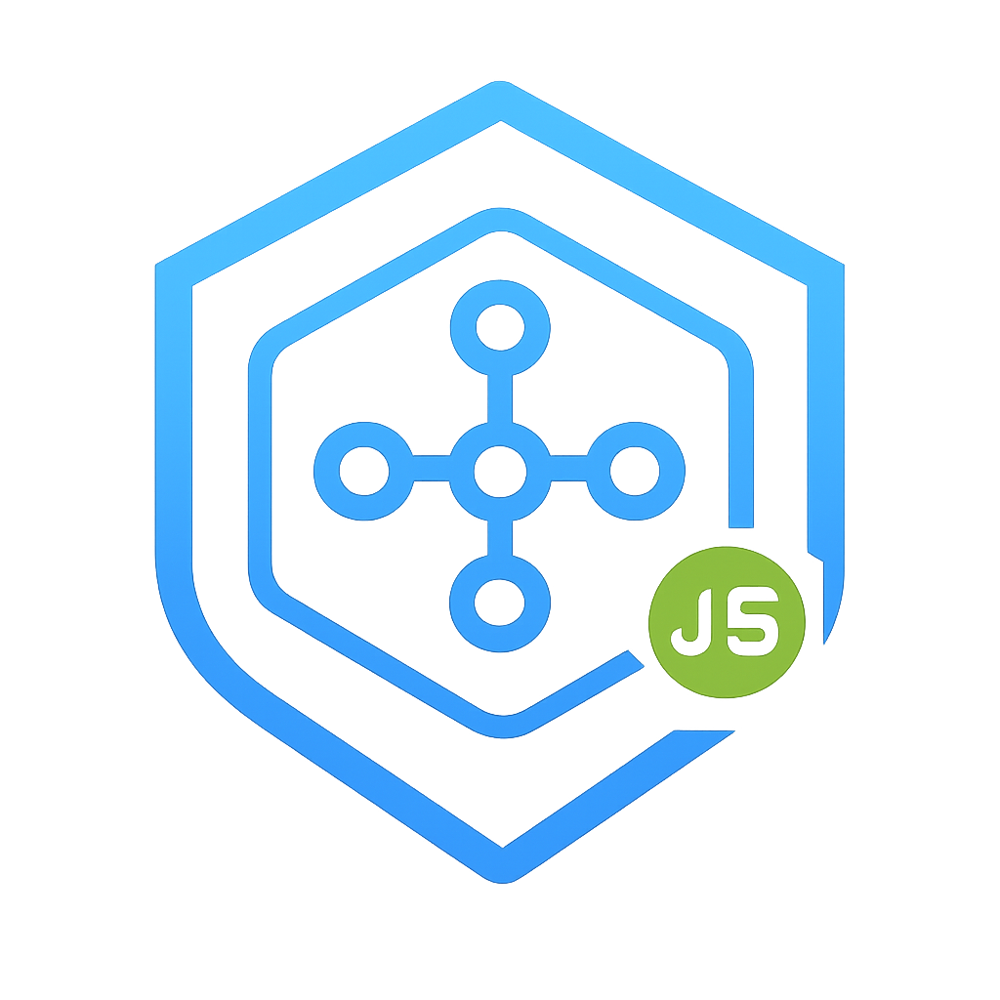

<div align="center">
  <h1 align="center">isoAutomate Node.js SDK</h1>
  
  <p align="center">
    <b>The Sovereign Browser Infrastructure & Orchestration Platform</b>
  </p>

  <a href="https://www.npmjs.com/package/isoautomate">
    
  </a>
  <a href="https://opensource.org/licenses/MIT">
    
  </a>
  <a href="https://isoautomate.com/docs">
    
  </a>
</div>

<br />

<div align="center">

</div>

## Introduction
The isoAutomate Node.js SDK is a production-grade client...

## Installation
```bash
npm install isoautomate
```

## Configuration

The SDK requires a Redis connection to communicate with isoFleet.
You may configure it using environment variables or direct initialization.

### Method 1: Environment Variables (.env)

**Option A: Single Redis URL**
```ini
REDIS_URL=rediss://:password@host:port/0
```

**Option B: Individual Fields**
```ini
REDIS_HOST=localhost
REDIS_PORT=6379
REDIS_PASSWORD=yourpassword
REDIS_DB=0
REDIS_SSL=false
```

### Method 2: Direct Initialization

**Using redisUrl**
```javascript
const { BrowserClient } = require('isoautomate');

const browser = new BrowserClient({
    redisUrl: "rediss://:password@host:port/0"
});
```

**Using Individual Arguments**
```javascript
const { BrowserClient } = require('isoautomate');

const browser = new BrowserClient({
    redisHost: "localhost",
    redisPort: 6379,
    redisPassword: "yourpassword",
    redisDb: 0,
    redisSsl: true
});
```

## Usage Examples

### Standard Async Usage

```javascript
const { BrowserClient } = require('isoautomate');

(async () => {
    const browser = new BrowserClient();
    
    try {
        // Acquire a session with recording enabled
        await browser.acquire("chrome", true);
        
        await browser.openUrl("https://example.com");
        await browser.assertText("Example Domain");

    } catch (err) {
        console.error("Test Failed:", err);
    } finally {
        // Browser is released here to ensure cleanup
        await browser.release();
        
        console.log(browser.videoUrl);
        console.log(browser.sessionData);
    }
})();

## Core Features

### Commercial Assertions

```javascript
await browser.assertText("Checkout Complete");
```

**Failure screenshots are saved to:**
screenshots/failures/

### Video Recording
```javascript
await browser.acquire("chrome", true);
await browser.openUrl("https://example.com");
await browser.release();
console.log(browser.videoUrl);
```

### MFA (Multi-Factor Authentication)
```javascript
const code = await browser.getMfaCode("YOUR_TOTP_SECRET");
console.log(code);
```

### Cookies
```javascript
await browser.saveCookies("cookies.json");
await browser.loadCookies("cookies.json");
```

### File Uploads
```javascript
await browser.uploadFile(
    "input[type='file']",
    "./document.pdf"
);
```

### Stealth & Low-Level Control
```javascript
const ua = await browser.getUserAgent();
console.log(ua);

await browser.evaluate("navigator.webdriver");
```

## Build & Publish Instructions

## License
**MIT License**
**Copyright (c) 2026 isoAutomate**
